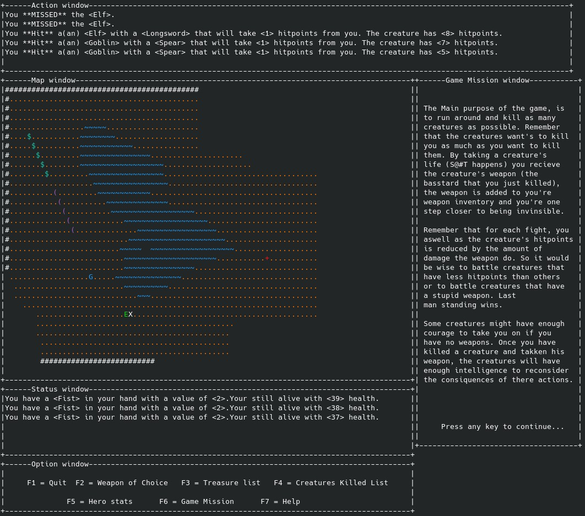

🎮 Game Overview

This is a terminal-based ASCII adventure game written in modern C++ using the ncurses library. You control a hero navigating through procedurally constructed maps filled with enemies, weapons, and treasures — all rendered with ASCII characters.



🕹️ Gameplay Summary

    Move your hero using arrow keys or number pad (supports diagonal movement).

    Explore rooms, collect weapons and treasures.

    Fight creatures (monsters), each with its own type and strength.

    Use doors, teleporters, and terrain to your advantage.

    Complete missions and progress through multiple maps (e.g., map1, map2).

    Health and damage stats are displayed in a status window.

    You win by surviving each level and clearing all enemies — or collecting the treasure goal.

🔑 Key Features

    Ncurses-based UI: Multiple windows (map_win, stat_win, etc.) drawn directly in the terminal.

    Modular design: Separate files for creatures, weapons, and treasures (creX, weaX, treX).

    Turn-based system: The hero and creatures act in turns.

    File-driven maps: Easily modifiable levels and content via text files.

    ASCII graphics: Every object (walls, players, enemies) is a character with a color.

⌨️ Controls
Arrow keys / NumPad (2/4/6/8)	Move in cardinal directions
NumPad (1/3/7/9)	Move diagonally
F1	Quit the game
F2	Open weapon chooser
F3	Show treasure list
F4	View kill list
F5	Show hero stats
F6	Read mission briefing
F7	Help screen

🔣 Map Symbols
Symbol	Meaning
#	Wall (not passable)
.	Walkable ground
T	Tree or obstacle
+	Closed door (can open)
/	Open door
$	Treasure
(	Weapon
0	Teleport square
X	Hero (you)
Letters (A, B, C...)	Enemies

🧱 Technical Highlights

    Written in modern C++ (C++17) with object-oriented architecture

    Uses ncurses for terminal windowing and input

    Thread-aware (uses std::this_thread::sleep_for for timing)

    Easily extensible via new factory types and map files

    Clean separation between logic, rendering, and file IO

🚀 Goal of the Game

The player must survive each level by:

    Defeating enemies

    Collecting weapons and treasures

    Completing the mission (if one is defined)

The game progresses by loading the next map in sequence (map2, map3, ...), each with increasing difficulty and new challenges.

This is a terminal-based ASCII game written in C++ using `ncurses` for rendering and standard C++ threads for timing and control.


📦 Dependencies

Install the following packages on Debian/Ubuntu:

```bash
sudo apt-get install g++
sudo apt-get install build-essential libncurses5-dev libncursesw5-dev gdb valgrind cmake libpthread-stubs0-dev
sudo apt-get install libncurses5-dev libncursesw5-dev
sudo apt-get install libncurses-dev

```
If some issues persist
```
sudo apt-get clean
sudo apt-get update
sudo apt --fix-broken install
```

Compile
```
g++ -g -pthread -c *.cpp
g++ -g -pthread -no-pie *.o -lncurses -o Game

```
Run
```
sudo chmod +x Game
./Game
```
